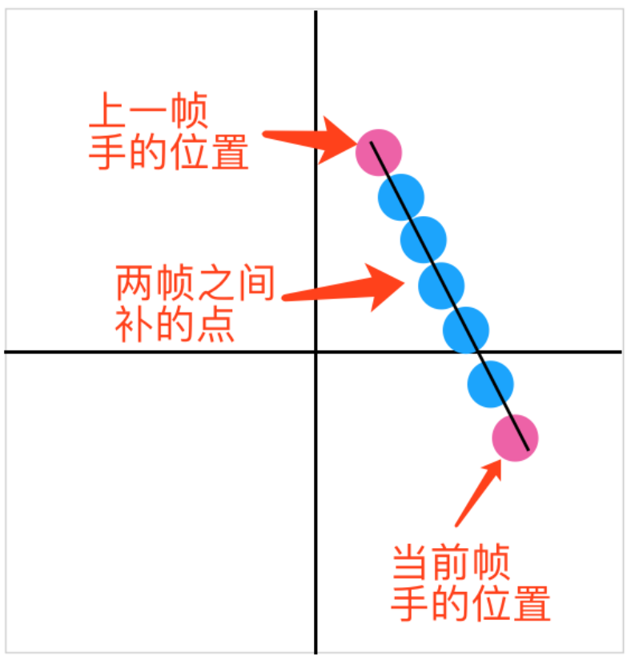

# bodydetect

## 概要
1. OpenGL基础概括
2. 使用OpenGL渲染实时YUV视频流
3. 使用OpenGL实现粒子效果

## 1. OpenGL基础概括
### 坐标系


* OpenGL顶点坐标系：
	* 原点在中心
	* x,y取值范围是：x,y ∈[-1, 1]
* UIKit坐标系：
	* 原点在左上角
	* x,y取值范围是：x ∈ [0, 屏幕宽度]，y ∈ [0, 屏幕高度]
* 纹理坐标系
	* 原点在左下角
	* x,y取值范围是：x,y ∈[0, 1]
* 图片坐标系【在iOS中通UIKit坐标系】
	* 原点在左上角
	* x,y取值范围是：x ∈ [0, 图片宽度]，y ∈ [0, 图片高度]

### 编写和加载GLSL文件
> GLSL是专门用作着色器编写的语言，它为图形计算量身定制，其中包含了向量和矩阵的操作特性

1. 每个着色器的入口点都是`main`函数
2. 在`main`函数之前声明输入和输出变量
3. 在`main`函数中处理所有输入变量，并把结果赋值给输出变量
4. 顶点着色器
	* 主要作用：确定渲染位置
5. 片段着色器【备注：有的文章也称为`片元着色器`，指的是一个意思】
	* 主要作用：确定渲染效果，简言之就是确定每一个像素的rgba如何显示到屏幕上
6.  iOS中加载`顶点着色器`和`片源着色器`：
	*  `GLuint program = [self loadShaders:@"Vertex" fragment:@"Fragment"]`
	* 保存加载成功后的program，它是对应着色器的句柄，在每次进行着色器渲染之前都需要指定渲染环境，代码调用即为：`glUseProgram(_program)`

	
```
#pragma mark - loadShader
- (GLuint)loadShaders:(NSString *)vertex fragment:(NSString *)fragment {
    GLuint vertexShader = [self compileShader:vertex type:GL_VERTEX_SHADER];
    GLuint fragmentShader = [self compileShader:fragment type:GL_FRAGMENT_SHADER];
    
    GLuint program = glCreateProgram();
    glAttachShader(program, vertexShader);
    glAttachShader(program, fragmentShader);
    glLinkProgram(program);
    
    glDeleteShader(vertexShader);
    glDeleteShader(fragmentShader);
    
    int linkSuccess;
    glGetProgramiv(program, GL_LINK_STATUS, &linkSuccess);
    if (linkSuccess == GL_FALSE) {
        GLchar messages[256];
        glGetProgramInfoLog(program, sizeof(messages), 0, &messages[0]);
        NSString *messageString = [NSString stringWithUTF8String:messages];
        NSLog(@"error%@", messageString);
        exit(1);
    }
    
    return program;
}

- (GLuint)compileShader:(NSString *)shaderName type:(GLenum)type {
    NSString *filePath = [[NSBundle mainBundle] pathForResource:shaderName ofType:@"glsl"];
    NSString *shaderStr = [NSString stringWithContentsOfFile:filePath encoding:NSUTF8StringEncoding error:nil];
    
    GLuint shader = glCreateShader(type);
    const char* shaderChar = [shaderStr UTF8String];
    GLint length = (GLint)shaderStr.length;
    glShaderSource(shader, 1, &shaderChar, &length);
    
    glCompileShader(shader);
    
    int compileSuccess;
    glGetShaderiv(shader, GL_COMPILE_STATUS, &compileSuccess);
    if (compileSuccess == GL_FALSE) {
        GLchar messages[256];
        glGetShaderInfoLog(shader, sizeof(messages), 0, &messages[0]);
        NSLog(@"compile shader: %@ error: %@", shaderName, [NSString stringWithUTF8String:messages]);
        exit(1);
    }
    return shader;
}
```
### 如何把CPU上的数据传递到GPU
* 数据有三种传递方式：
	* CPU到GPU
		* 数据从CPU传到顶点着色器
		* 数据从CPU传到片段着色器
	* 数据从顶点着色器传到片段着色器

#### 数据从CPU传到顶点着色器
1. 首先需要得到加载着色器之后的program
2. 通过glGetAttribLocation获取指定顶点着色器中变量值的句柄
3. 再通过glVertexAttribPointer给指定的句柄传值


```
GLfloat quadTextureData[] =  { // 正常纹理坐标
	0, 0,
	1, 0,
	0, 1,
	1, 1
	};
GLuint _texCoordSlot = glGetAttribLocation(_program, "texCoord");
glVertexAttribPointer(_texCoordSlot, 2, GL_FLOAT, 0, 0, quadTextureData);
glEnableVertexAttribArray(_texCoordSlot);
```

* 顶点着色器`Vertex.glsl`


```
attribute vec4 position; // cpu传过来的顶点坐标
attribute vec2 textCoordinate; // cpu传过来的纹理坐标
varying lowp vec2 varyTextCoord; // 传递给片段着色器的纹理坐标

void main()
{
    varyTextCoord = textCoordinate;
    gl_Position = position;
}
```

* 片段着色器`Fragment.gls`
```
varying lowp vec2 varyTextCoord; // 顶点着色器传过来的纹理坐标
uniform sampler2D colorMap; // cpu传过来的纹理
uniform float opacity;

void main()
{
    gl_FragColor = texture2D(colorMap, varyTextCoord);
}
```
#### 数据从CPU传到片元着色器——Uniform
使用Uniform声明的变量是全局，它在每个着色器对象中都是独一无二的。所以使用Uniform不仅可以从CPU传值给顶点着色器，也可以用它传值给片元着色器。

1. 首先需要得到加载着色器之后的program
2. 通过glGetUniformLocation获取指定片元着色器中变量值的句柄
3. 再通过glUniform1f给指定的句柄传值


```
GLuint opacitySlot = glGetUniformLocation(program, "opacity");
glUniform1f(opacitySlot, 0.5);
```

#### 数据从顶点着色器到片元着色器
如果我们打算从一个着色器向另一个着色器发送数据，我们必须在发送方着色器中声明一个输出，在接收方着色器中声明一个类似的输入。当类型和名字都一样的时候，OpenGL就会把两个变量链接到一起，它们之间就能发送数据了（这是在链接程序对象时完成的）。例如Vertex.glsl和Fragment.glsl中的`varyTextCoord`

## 2. 使用OpenGL渲染实时YUV视频流
在OpenGL中，片元着色器最后输出的都是rgba的数据，所以使用OpenGL来渲染YUV数据的关键还是将YUV数据传递给着色器，并在着色器中将YUV转化为RGB

在CPU端通过CVOpenGLESTextureCacheCreateTextureFromImage函数获取Y纹理和UV纹理

```
// Y
CVOpenGLESTextureCacheCreateTextureFromImage(kCFAllocatorDefault, _videoTextureCache, pixelBuffer, NULL, GL_TEXTURE_2D, GL_LUMINANCE, frameWidth, frameHeight, GL_LUMINANCE, GL_UNSIGNED_BYTE, 0, &_lumaTexture)

// UV
CVOpenGLESTextureCacheCreateTextureFromImage(kCFAllocatorDefault, _videoTextureCache, pixelBuffer, NULL, GL_TEXTURE_2D, GL_LUMINANCE_ALPHA, frameWidth * 0.5, frameHeight * 0.5, GL_LUMINANCE_ALPHA, GL_UNSIGNED_BYTE, 1, &_chromaTexture);
```
把数据传递到片元着色器中后，只需要在片元着色器合并成rgba输出即可。
Y中主要存储的是图像的样式
UV中主要存储的是图像的颜色

```
precision mediump float;
varying highp vec2 varyingTexCoord;
uniform sampler2D samplerY; // Y纹理
uniform sampler2D samplerUV; // UV纹理
uniform mat3 colorConversionMatrix;

void main() {
    mediump vec3 yuv;
    yuv.x = (texture2D(samplerY, varyingTexCoord).r);
    yuv.yz = (texture2D(samplerUV, varyingTexCoord).ra - vec2(0.5, 0.5));
    
    lowp vec3 rgb = colorConversionMatrix * yuv;
    
    gl_FragColor = vec4(rgb, 1);
}
```
colorConversionMatrix的值是由cpu传过来的，具体值是：

```
{
    1.0,    1.0,    1.0,
    0.0,    -0.343, 1.765,
    1.4,    -0.711, 0.0,
}
```

## 3. 使用OpenGL实现粒子效果
#### 1. 定义粒子的移动方式
```
typedef struct {
    GLKVector2 wy_position; // 点的位置
    GLKVector3 wy_color;    // 点的颜色
    GLKVector2 wy_velocity; // 点在x和y方向上的移动速度
    GLfloat    wy_flag;     // 标记是粒子特效的点
    GLKVector2 wy_emissionTimeAndLife; // 粒子发射时间和存活时间
}WYParticle;
```

#### 2. 使用OpenCV识别人手位置

识别出来的人手的点是基于图片坐标的，我们需要把这个点转化为OpenGL中的坐标点。转化流程为：图片坐标系——>纹理坐标系——>顶点坐标系。Demo中纹理是全填充的，所以可以得到转化方式：

```
- (CGPoint)convertOpenGLPoint:(CGPoint)point {
    CGFloat x =  point.x;
    CGFloat y =  point.y;
    
    CGFloat halfW = 720 * 0.5; // 720为图片宽度
    CGFloat halfH = 1280 * 0.5; // 1280为图片高度
    
    CGFloat normalX = (x - halfW) / halfW;
    CGFloat normalY = (halfH - y) / halfH;
    
    CGPoint glPoint = CGPointMake(normalX, normalY);
    
    return glPoint;
}
```
#### 3. 把人手点从CPU传到GPU顶点着色器
这里需要使用一个数组把所有曾经识别到的点都存起来，因为这些点是有生命的，之前的点可能还处于存活时间内。

在增加新的点的时候，我们要设置点在x和y轴上的移动速度，因为OpenGL顶点坐标系取值范围是[-1, 1]，所以我们使用`float randomXVelocity = (-0.5f + (float)random() / RAND_MAX);`来设置点在x和y轴上的移动速度，使点能向4个方向发散

```
CGPoint point = [value CGPointValue];

float randomXVelocity = (-0.5f + (float)random() / RAND_MAX);
float randomYVelocity = (-0.5f + (float)random() / RAND_MAX);

CGFloat lifeSpan = _lifeSpan;
if (i > 2) {
    randomXVelocity = randomXVelocity / 5.0;
    randomYVelocity = randomYVelocity / 5.0;
    lifeSpan = lifeSpan * 0.8;
}

float r = (float)random() / RAND_MAX;
float g = (float)random() / RAND_MAX;
float b = (float)random() / RAND_MAX;

WYParticle particle;
particle.wy_position = GLKVector2Make(point.x, point.y);
particle.wy_color = GLKVector3Make(r, g, b);
particle.wy_flag = 1;
particle.wy_emissionTimeAndLife = GLKVector2Make(_elapsedTime, lifeSpan);
particle.wy_velocity = GLKVector2Make(randomXVelocity, randomYVelocity);

[self wy_addParticle:particle];
```

#### 在GPU上渲染出点
一个点一旦生成，那么它的初始位置就是不变的，我们需要根据点在x和y轴上的速度，以及这个点从开始到现在逝去的时间计算点当前的位置。

```
elapsedTime = currentTime - emissionTimeAndLife.x; // 流逝时间
// 流逝的时间乘以在x和y轴上的速度就是移动的距离
vec2 deltaP = elapsedTime * velocity; 
// 把移动距离和初始距离相加就是当前时刻应该在的位置
vec2 wy_position = position + deltaP;
gl_Position =  vec4(wy_position, 0.0, 1.0);
```

#### 补点
一般视频都是16帧或者24帧，如果人手移动太快，两个视频帧之间识别到的手的位置就会有一段比较大的距离，这就会导致粒子效果看起来有隔断。

**解决方案：** 每次在更新人手位置的时候，顺带保存上一帧视频识别到的人手位置，每次在添加粒子的时候，计算上一帧视频人手位置和本次人手位置之间的距离，然后用粒子进行补齐。




```
- (NSMutableArray<NSValue*> *)generatePoints:(CGPoint)prePoint currentPoint:(CGPoint)currenPoint arr:(NSMutableArray *)arrM {
    
    CGFloat leftX = currenPoint.x;
    CGFloat leftY = currenPoint.y;
    CGFloat preX = prePoint.x;
    CGFloat preY = prePoint.y;
    
    CGFloat screenW = 720; // 图片宽度
    CGFloat screenH = 1280; // 图片高度
    
    CGFloat pointW =  10; // 点的宽度
    CGFloat caculate = sqrtf((pointW / screenW) * (pointW / screenW) + (pointW / screenH) * (pointW / screenH));
    CGFloat deltaX = leftX - preX;
    CGFloat deltaY = leftY - preY;

    // 两点之间的距离
    CGFloat distance = sqrtf(deltaX * deltaX + deltaY * deltaY);
    int count = ceilf(distance / caculate);
    
    if (count < 3) {
        [arrM addObject:@(currenPoint)];
        return arrM;
    };
    
    CGFloat addX = 0;
    CGFloat addY = 0;
    for (int i = 0; i < count; i++) {
        addX = preX + (CGFloat)i * deltaX / count;
        addY = preY + (CGFloat)i * deltaY / count;
        CGPoint point = CGPointMake(addX, addY);
        [arrM addObject:@(point)];
    }
    [arrM addObject:@(currenPoint)];
    
    return arrM;
}
```
#### 最终效果

#### Demo
https://github.com/wangyansnow/bodydetect

